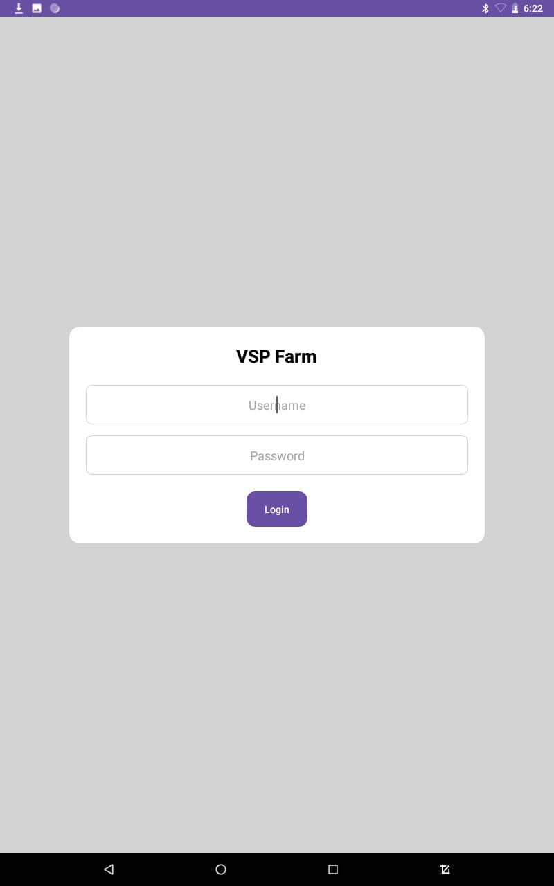
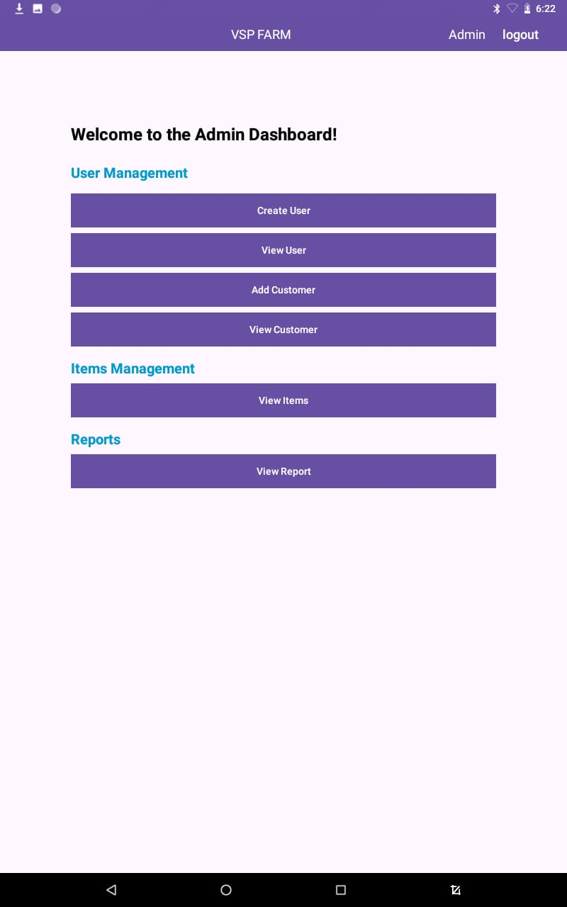
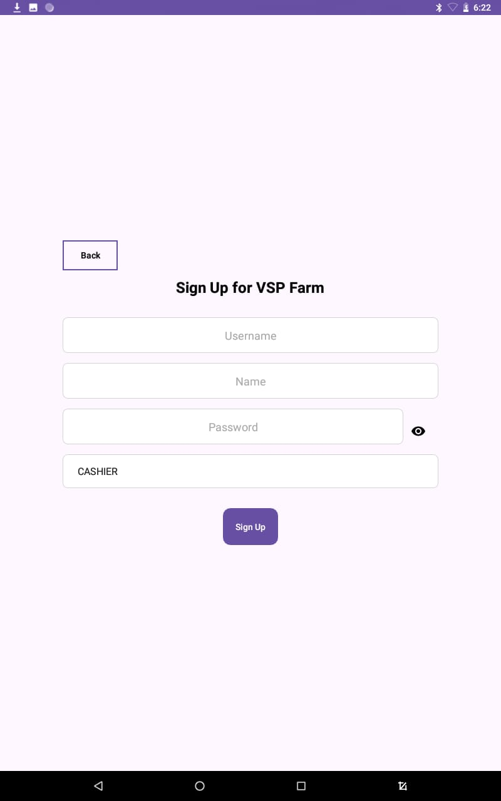
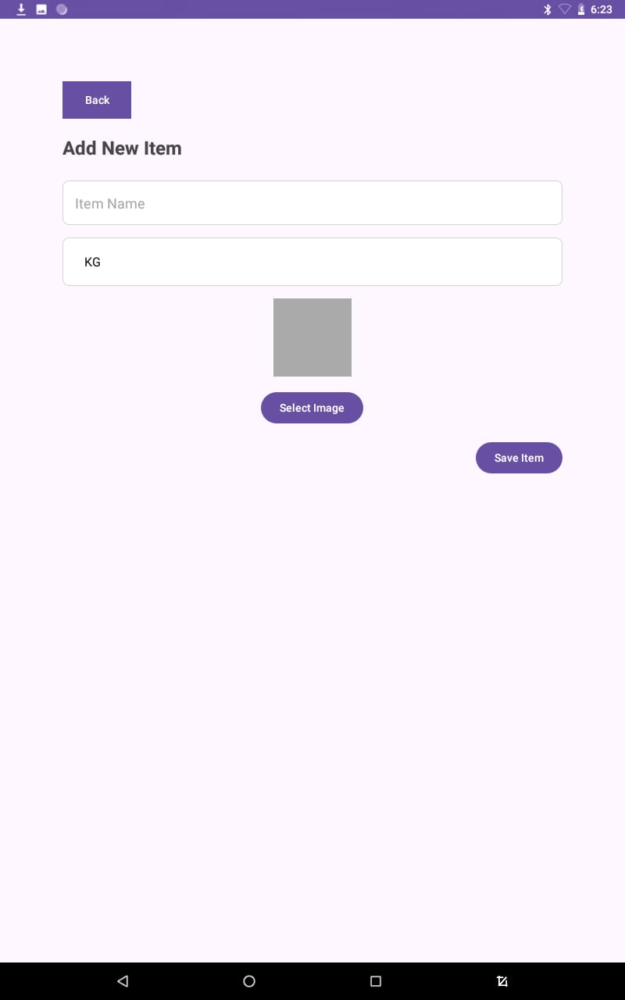
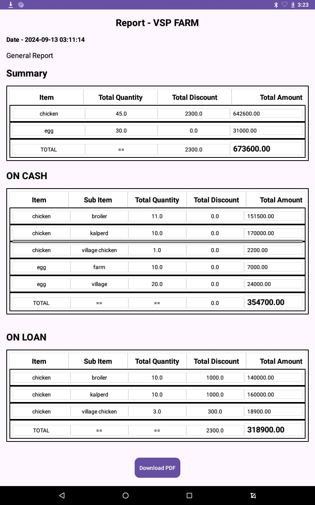
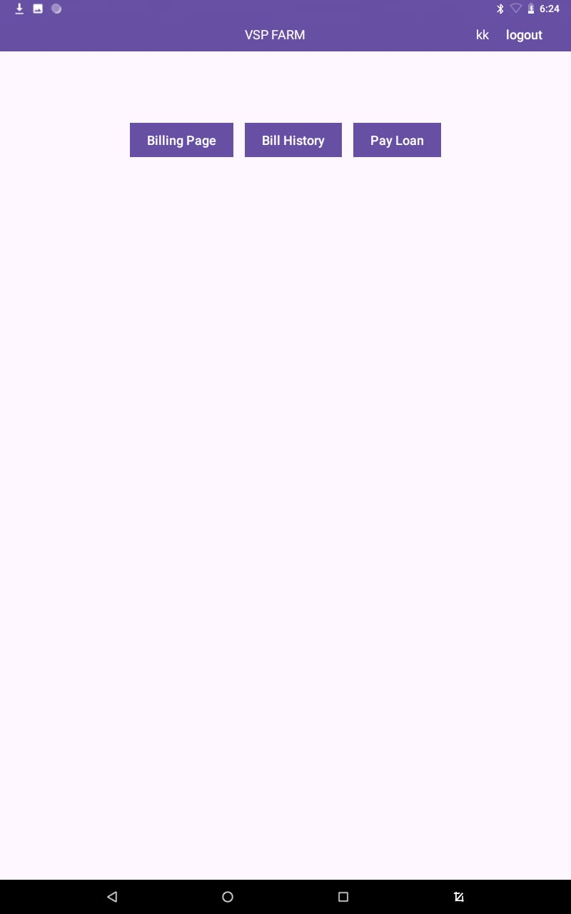
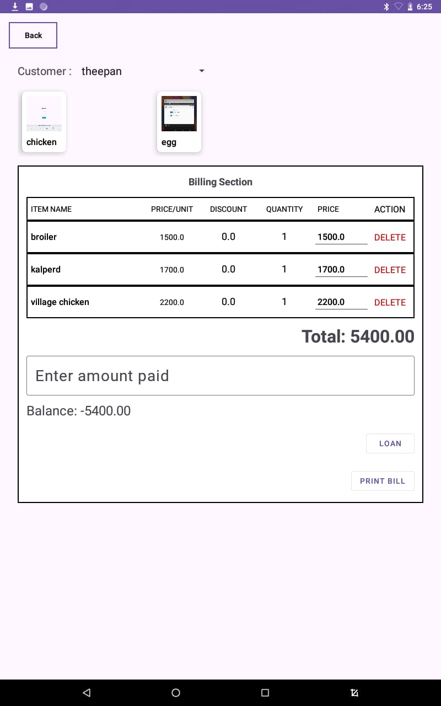
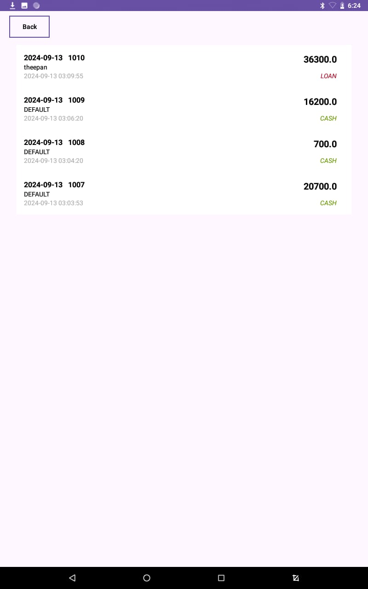
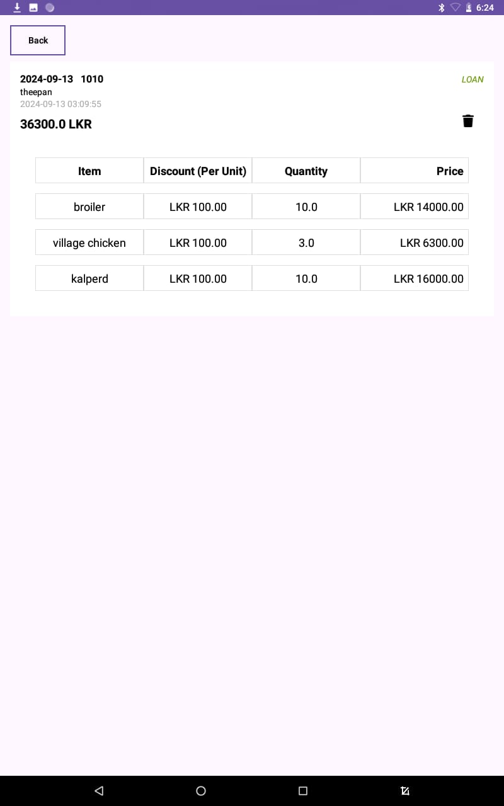
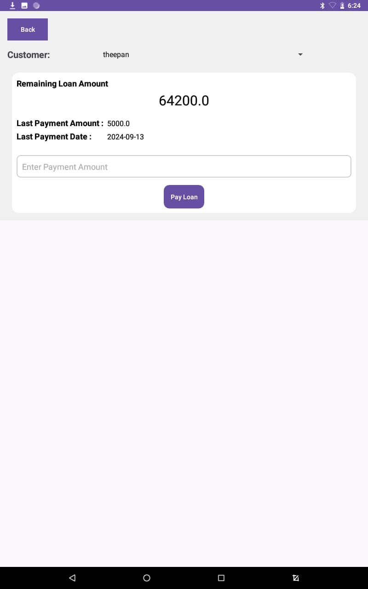

# VSP Farm

VSP Farm is a management system designed to handle customer billing, item management, and loan reports. It supports two main user roles: **Admin** and **Cashier**, each with specific functionalities.

---

## EpsonPrinterHelper

**Important Notice:**  
Due to the sensitive nature of the billing format contained within the `EpsonPrinterHelper` class, the complete code for this component cannot be provided. For guidance on creating this class, refer to the documentation available in the `document` folder:  

- [Epson SDK PDF Documentation](ePOS_SDK_Android.pdf)  
- [Epson Official Documentation](https://download4.epson.biz/sec_pubs/pos/reference_en/epos_and/index.html)  

For any questions or clarifications, feel free to reach out!

---

## Version 2 Features

1. **Add User Permissions**  
   Introduced enhanced controls for managing user roles and access rights.

2. **Product Deletion**  
   Admins can now delete products directly from the system.

3. **Add Expense Tracking**  
   A new feature to log and track expenses.

4. **Improved Printing Functionality**  
   Optimized the printing process for better performance and reliability.

5. **Bug Fix: Printing**  
   Resolved issues causing printing failures.

6. **Updated Loan Payment Method**  
   Users can now pay loans in partial amounts.

---

## Overview

VSP Farm is designed to streamline operations for customer billing, item management, and loan reports. Below is an outline of the functionalities available for each role:


## Admin Functionalities

1. **Generate PDF Reports**
   - Current Day Summary (including credit payments)
   - Current Day Details (all relevant details)
   - Summary Report within a Date Range
   - Detailed Report within a Date Range
   - Report by Customer
   - Loan Payments Report by Customer

2. **User Management**
   - **Create User (Admin/Cashier)**
     - Admin can create new users with designated roles.
   - **Delete Users**
     - Admin has the authority to remove users from the system.

3. **Customer Management**
   - **Create Customer**
     - Only customers registered by the Admin are eligible for discounts and can opt to pay later.
     - Default customers do not receive any discount.

4. **Item Management**
   - **Manage Items and Sub-items**
     - Admin can create, edit, or delete items and their associated sub-items.

5. **Report Viewing**
   - **View Bill and Loan Reports**
     - Admin can view detailed reports of all bills and loans.
   - **Delete Bills**
     - Admin can delete bills from the system.

---

### **Cashier Functionalities**

1. **Billing**  
   - Generate bills for customer purchases.

2. **View and Manage Bills**  
   - View bills generated on the current day.
   - Delete bills (marked as **DELETED** in the database).
3. **Loan Payments**  
   - Process customer loan payments, including partial payments.

---

## Installation

1. Clone the repository:
   ```bash
   git clone https://github.com/karththikeyanK/VSP_Farm.git

## Screenshots

### Admin

<table align="center">
  <tr>
    <td align="center">
      
      <br>
      <em>Login Page</em>
    </td>
    <td align="center">
      
      <br>
      <em>Admin Dashboard</em>
    </td>
    <td align="center">
      
      <br>
      <em>Create User</em>
    </td>
  </tr>
  <tr>
    <td align="center">
      
      <br>
      <em>Add Items</em>
    </td>
    <td align="center">
      
      <br>
      <em>Today Report</em>
    </td>
    
  </tr>
</table>

### Cashier

<table align="center">
  <tr>
    <td align="center">
      
      <br>
      <em>Cashier Dashboard</em>
    </td>
    <td align="center">
      
      <br>
      <em>Billing Page</em>
    </td>
    <td align="center">
      
      <br>
      <em>View Bills</em>
    </td>
    <td align="center">
      
      <br>
      <em>View Bill Details</em>
    </td>
  </tr>
  <tr>
    <td align="center">
      
      <br>
      <em>Pay Loan</em>
    </td>
    <!-- Add more images here if necessary -->
  </tr>
</table>


// welcome@1234

