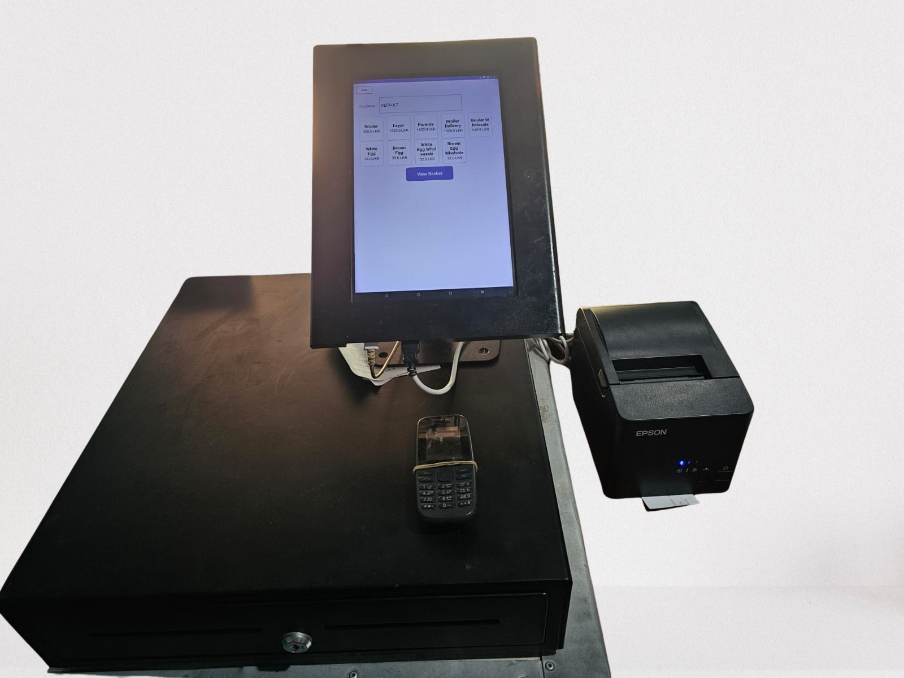
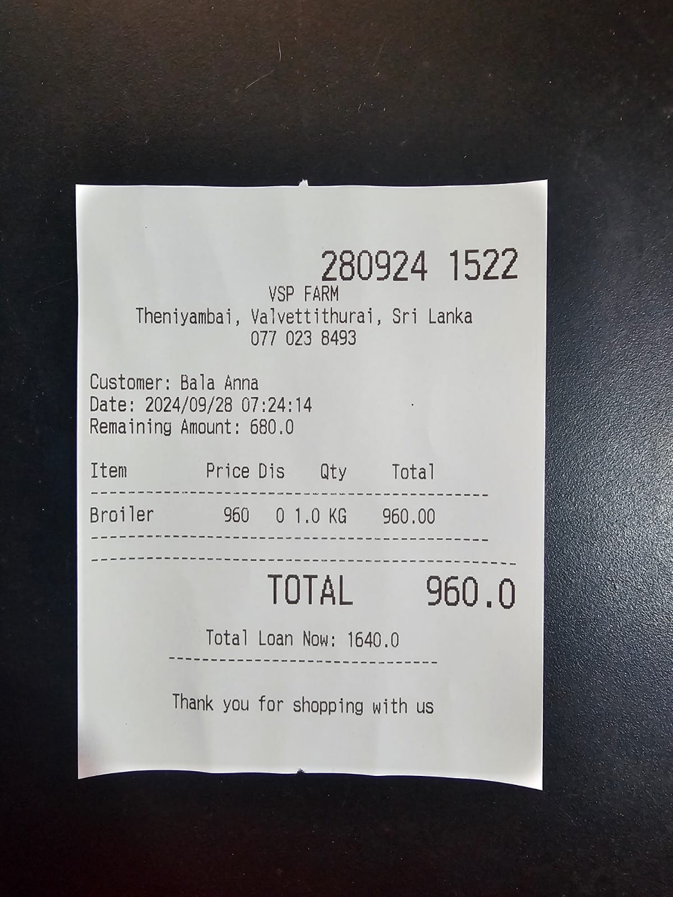
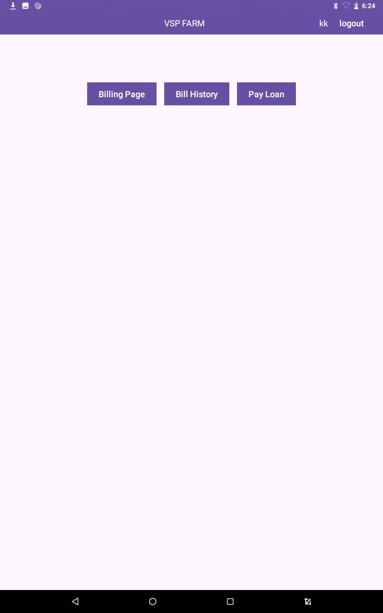

# VSP Farm

## EpsonPrinterHelper!!

**Important Notice:** Due to the sensitive nature of the billing format contained within the `EpsonPrinterHelper` class, I am unable to provide the complete code for this component. However, you can refer to the documentation available in the document folder for guidance on creating this class. It includes essential information on the required methods and formatting.
[EpsonPdf](ePOS_SDK_Android.pdf)

Or

[Epson official docs](https://download4.epson.biz/sec_pubs/pos/reference_en/epos_and/index.html)

For any further questions or clarifications, please feel free to reach out!


## Overview

VSP Farm is a management system designed to handle customer billing, item management, and loan reports. It has two main user roles: **Admin** and **Cashier**, each with their specific functionalities.

<table align="center">
  <tr>
    <td align="center">
      
      <br>
      <em>POS Machine</em>
    </td>
    <td align="center">
      
      <br>
      <em>Sample Bills</em>
    </td>
  </tr>
</table>


## Functionalities

## Admin Functionalities

1. **Generate PDF Reports**
   - Current Day Summary (including credit payments)
   - Current Day Details (all relevant details)
   - Summary Report within a Date Range
   - Detailed Report within a Date Range
   - Report by Customer
   - Loan Payments Report by Customer

2. **User Management**
   - **Create User (Admin/Cashier)**
     - Admin can create new users with designated roles.
   - **Delete Users**
     - Admin has the authority to remove users from the system.

3. **Customer Management**
   - **Create Customer**
     - Only customers registered by the Admin are eligible for discounts and can opt to pay later.
     - Default customers do not receive any discount.

4. **Item Management**
   - **Manage Items and Sub-items**
     - Admin can create, edit, or delete items and their associated sub-items.

5. **Report Viewing**
   - **View Bill and Loan Reports**
     - Admin can view detailed reports of all bills and loans.
   - **Delete Bills**
     - Admin can delete bills from the system.

### Cashier
The Cashier primarily handles billing and loan payments. The Cashier functionalities include:

1. **Generate Bills for Items**
    - Cashier can generate bills for the items being purchased by customers.

2. **View and Delete Current Day Bills**
    - Cashier can view the bills generated on the current day and has the option to delete them.
    - **Note:** When a bill is deleted, it is not removed from the database. Instead, the status of the bill is updated to **DELETED**.

3. **Process Loan Payments**
    - Cashier can process loan payments from customers.

---

## Installation

1. Clone the repository:
   ```bash
   https://github.com/karththikeyanK/VSP_Farm.git
   ```

## Screenshots

### Admin

<table align="center">
  <tr>
    <td align="center">
      
      <br>
      <em>Login Page</em>
    </td>
    <td align="center">
      
      <br>
      <em>Admin Dashboard</em>
    </td>
    <td align="center">
      
      <br>
      <em>Create User</em>
    </td>
  </tr>
  <tr>
    <td align="center">
      
      <br>
      <em>Add Items</em>
    </td>
    <td align="center">
      
      <br>
      <em>Today Report</em>
    </td>
    
  </tr>
</table>

### Cashier

<table align="center">
  <tr>
    <td align="center">
      
      <br>
      <em>Cashier Dashboard</em>
    </td>
    <td align="center">
      
      <br>
      <em>Billing Page</em>
    </td>
    <td align="center">
      
      <br>
      <em>View Bills</em>
    </td>
    <td align="center">
      
      <br>
      <em>View Bill Details</em>
    </td>
  </tr>
  <tr>
    <td align="center">
      
      <br>
      <em>Pay Loan</em>
    </td>
    <!-- Add more images here if necessary -->
  </tr>
</table>


// welcome@1234

